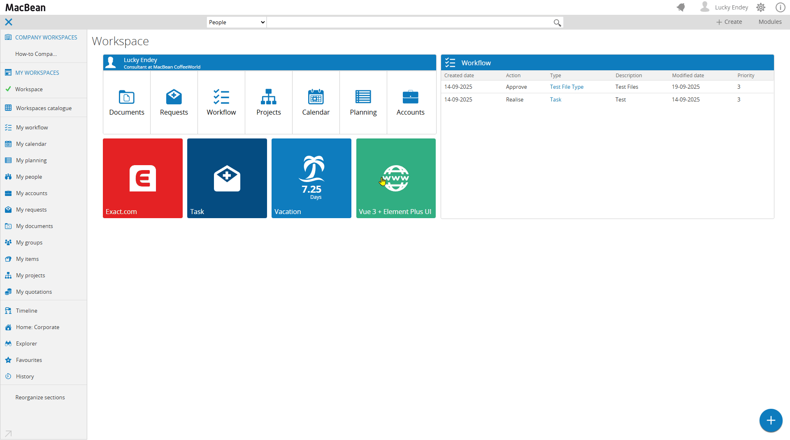

# Embed Vue 3 into Exact Synergy Enterprise

A drop-in ASPX page that brings a modern, responsive employee directory to Exact Synergy Enterprise using Vue 3 and Element Plus.

## Features
- Responsive employee card grid (Vue 3 + Element Plus)
- Avatar initials fallback with base64 photo support
- Skeleton loaders and smooth hover effects

## Quick start
1. Copy everything inside `docs/` to your Exact Synergy `docs` folder.
2. Open `CustomPeopleCard.aspx` inside Synergy.
3. Ensure the callback page is reachable and your user has HRM permissions.

Tip: If `$.ajax` isn’t available in your environment, include jQuery or replace the call with `fetch`.

## Key files
- `docs/CustomPeopleCard.aspx` — Main UI page (Vue + Element Plus)
- `docs/CustomPeopleCardCallback.aspx` — Returns employee data as JSON
- `docs/vue-3.5.22.js`, `docs/element-plus.js`, `docs/element-plus.css` — Local libraries

## Links
- Vue 3: https://vuejs.org/
- Element Plus: https://element-plus.org/